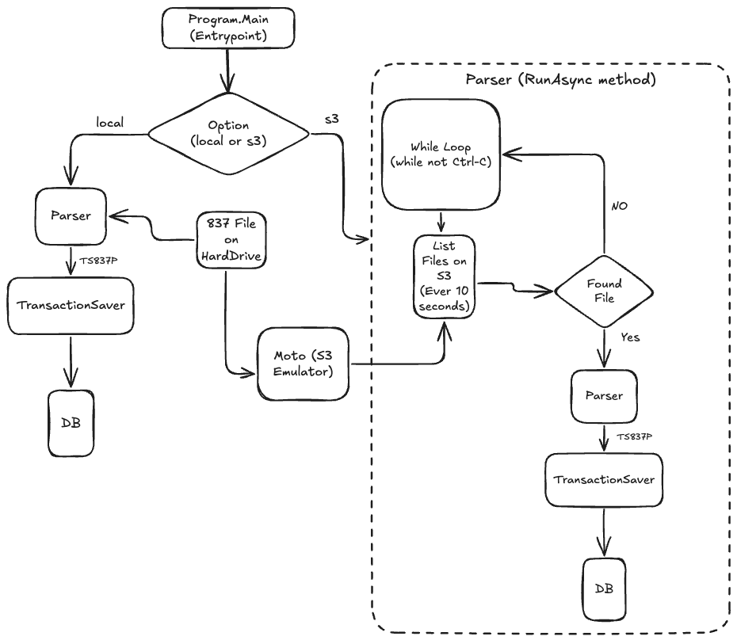

# Program Flow
The entrypoint is Program.Main.
An option "local" or "s3" is passed in when running (default is local)
If "local" is given, the hardcoded file path is given to the parser, which returns the parsed transaction object (TS837P). That object is then given to the TransactionSaver to be saved to the database.

The S3 path is the same except that there is a while loop that listens for files coming in via an S3Gateway. The loop polls every 10 seconds for new files. When it finds one, it processes it the same way that the "local" path does.

